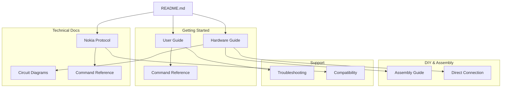

# Nokia 3310 CAN Bus Interface Documentation

## 📚 Documentation Map


## 🔍 Documentation Search Guide

### By Topic
1. **Car Diagnostics**
   - [Command Reference](COMMAND_REFERENCE.md): OBD-II commands
   - [User Guide](USER_GUIDE.md): Basic operations
   - Keywords: PID, OBD, diagnostic, sensor

2. **Hardware Setup**
   - [Hardware Guide](HARDWARE_GUIDE.md): Basic connections
   - [Assembly Guide](ASSEMBLY_GUIDE.md): Building guide
   - Keywords: wiring, connection, adapter, power

3. **Phone Interface**
   - [Nokia Protocol](NOKIA_PROTOCOL.md): FBUS details
   - [Direct Connection](DIRECT_CONNECTION_GUIDE.md): Standalone mode
   - Keywords: FBUS, display, keypad, menu

4. **Troubleshooting**
   - [Troubleshooting Guide](TROUBLESHOOTING.md): Common issues
   - [Compatibility](COMPATIBILITY.md): Device support
   - Keywords: error, problem, debug, fix

### Common Tasks
1. **First-Time Setup**
   ```
   README.md
   └── User Guide
       └── Hardware Guide
           └── Assembly Guide
   ```

2. **Building the Adapter**
   ```
   Hardware Guide
   └── Circuit Diagrams
       └── Assembly Guide
           └── Direct Connection Guide
   ```

3. **Adding Commands**
   ```
   User Guide
   └── Command Reference
       └── Nokia Protocol
           └── Direct Connection Guide
   ```

4. **Fixing Issues**
   ```
   Troubleshooting Guide
   └── Hardware Guide
       └── Compatibility
           └── Nokia Protocol
   ```

### Search Tips

#### 1. Finding Information
- Start with the relevant section in the map above
- Use Ctrl+F in documents to find keywords
- Check related documents in navigation

#### 2. Common Keywords
```
Setup & Installation
- install, setup, configure, requirements
- python, dependencies, libraries
- connection, wiring, power

Hardware & Assembly
- adapter, cable, connector, pin
- voltage, power, ground, VCC
- solder, assemble, build, wire

Operation & Commands
- command, PID, OBD, CAN
- display, menu, keypad, button
- save, load, execute, read

Troubleshooting
- error, issue, problem, fail
- debug, test, check, verify
- LED, status, indicator
```

#### 3. Document Conventions
```
Code Blocks:   `code`
Commands:      $ command
Important:     ⚠️ Note
Tips:          💡 Tip
Success:       ✅ Done
Error:         ❌ Failed
```

#### 4. Version Information
```
Documentation Version: 1.0
Last Updated: January 2025
Project Version: 1.0.0
```

## 📚 Documentation Index

### Getting Started
1. [User Guide](USER_GUIDE.md)
   - Basic setup and usage
   - Menu navigation
   - Command execution
   - Data interpretation

2. [Hardware Guide](HARDWARE_GUIDE.md)
   - Connection diagrams
   - Cable specifications
   - Power requirements
   - Safety precautions

3. [Command Reference](COMMAND_REFERENCE.md)
   - OBD-II commands
   - PID descriptions
   - Data formats
   - Examples

### Technical Documentation
1. [Nokia Protocol](NOKIA_PROTOCOL.md)
   - FBUS protocol details
   - Frame formats
   - Command structures
   - Implementation notes

2. [Compatibility Guide](COMPATIBILITY.md)
   - Supported phones
   - Vehicle compatibility
   - Hardware requirements
   - Software versions

3. [Circuit Diagrams](CIRCUIT_DIAGRAMS.md)
   - Schematic drawings
   - PCB layouts
   - Component lists
   - Assembly notes

### DIY & Assembly
1. [Direct Connection Guide](DIRECT_CONNECTION_GUIDE.md)
   - Standalone operation
   - Component selection
   - Power management
   - Interface design

2. [Assembly Guide](ASSEMBLY_GUIDE.md)
   - Step-by-step instructions
   - Testing procedures
   - Quality checks
   - Safety measures

### Support & Troubleshooting
1. [Troubleshooting Guide](TROUBLESHOOTING.md)
   - Common issues
   - Diagnostic procedures
   - Error codes
   - Recovery steps

## 🔍 Quick Links

### By Topic
- **Setup**: [User Guide](USER_GUIDE.md) | [Hardware Guide](HARDWARE_GUIDE.md)
- **Technical**: [Nokia Protocol](NOKIA_PROTOCOL.md) | [Circuit Diagrams](CIRCUIT_DIAGRAMS.md)
- **Building**: [Assembly Guide](ASSEMBLY_GUIDE.md) | [Direct Connection](DIRECT_CONNECTION_GUIDE.md)
- **Support**: [Troubleshooting](TROUBLESHOOTING.md) | [Compatibility](COMPATIBILITY.md)

### By Task
- **New User**: Start with [User Guide](USER_GUIDE.md)
- **Building Hardware**: See [Assembly Guide](ASSEMBLY_GUIDE.md)
- **Having Issues**: Check [Troubleshooting](TROUBLESHOOTING.md)
- **Adding Commands**: Read [Command Reference](COMMAND_REFERENCE.md)

## 📖 Document Conventions

### Navigation
Each document includes:
- Top navigation bar
- Related documents section
- Quick links to other guides
- Return to index link

### Symbols
- 📚 Documentation
- 🔧 Tools/Setup
- ⚠️ Warning/Important
- 💡 Tip/Note
- ✅ Success/Compatible
- ❌ Error/Incompatible

## 🔄 Document Updates

### Version Control
- All documents are versioned
- Changes are tracked in Git
- Updates noted in changelogs
- Regular review process

### Contributing
- Submit issues on GitHub
- Propose document changes
- Add new sections
- Improve examples

## 📱 Project Links

- [Main Repository](https://github.com/khanfar/Nokia-3310-CAN-Bus-Interface)
- [Latest Release](https://github.com/khanfar/Nokia-3310-CAN-Bus-Interface/releases)
- [Issue Tracker](https://github.com/khanfar/Nokia-3310-CAN-Bus-Interface/issues)

---
Copyright (c) 2025 Khanfar - Educational Project  
https://github.com/khanfar/Nokia-3310-CAN-Bus-Interface
